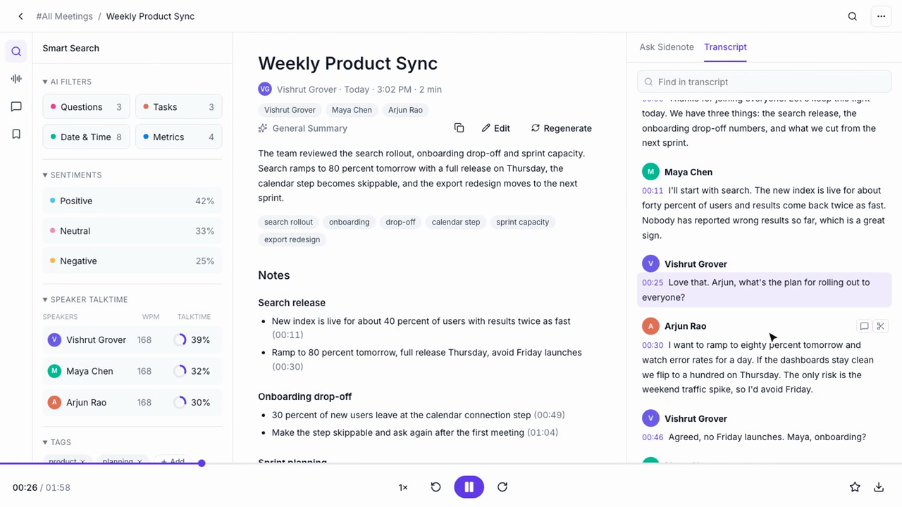
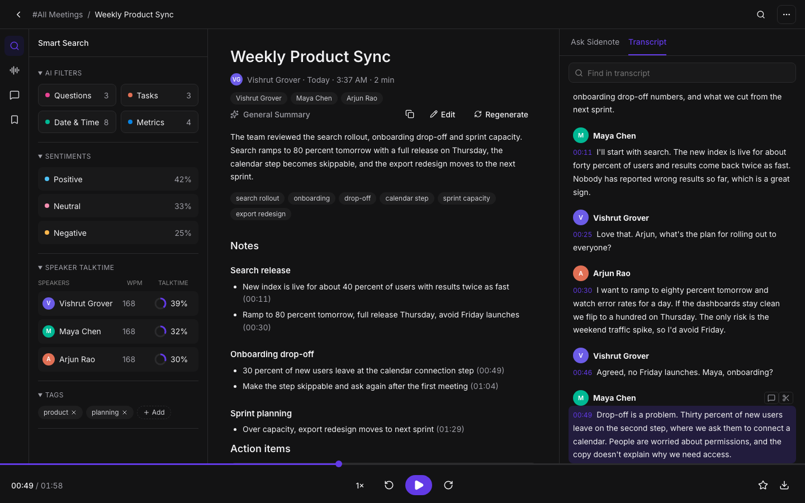
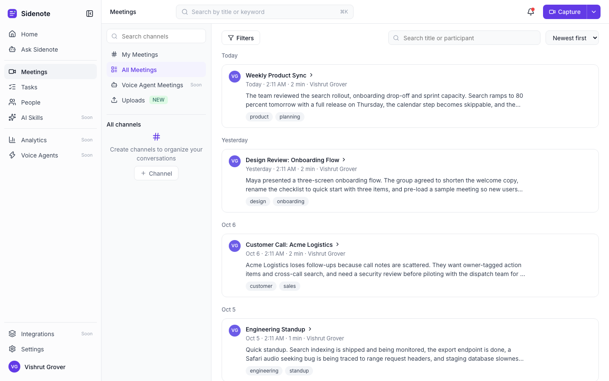
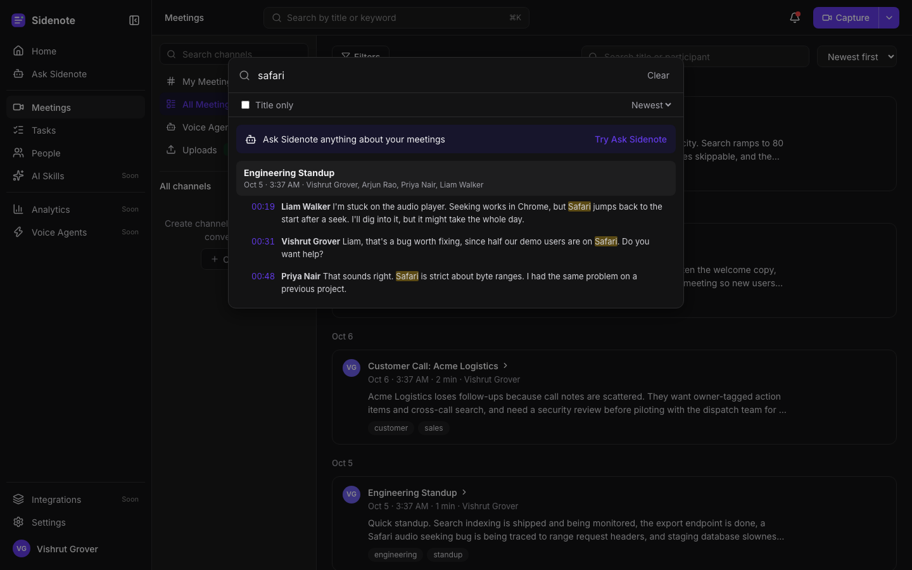
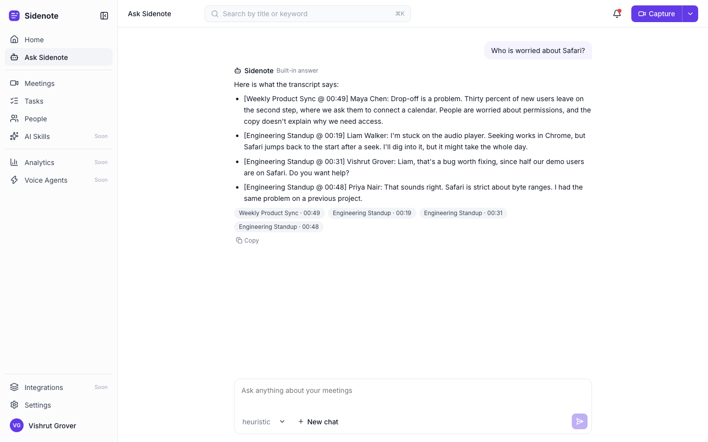
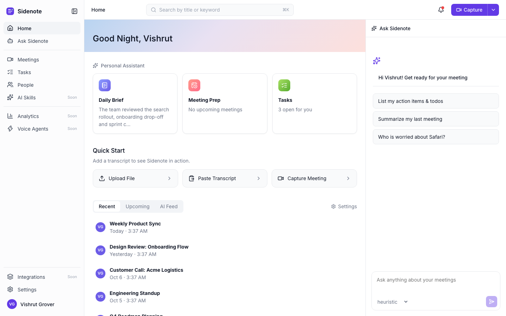
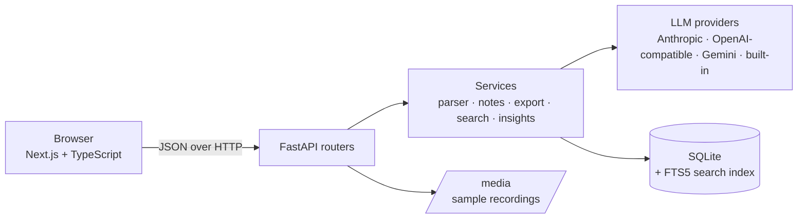
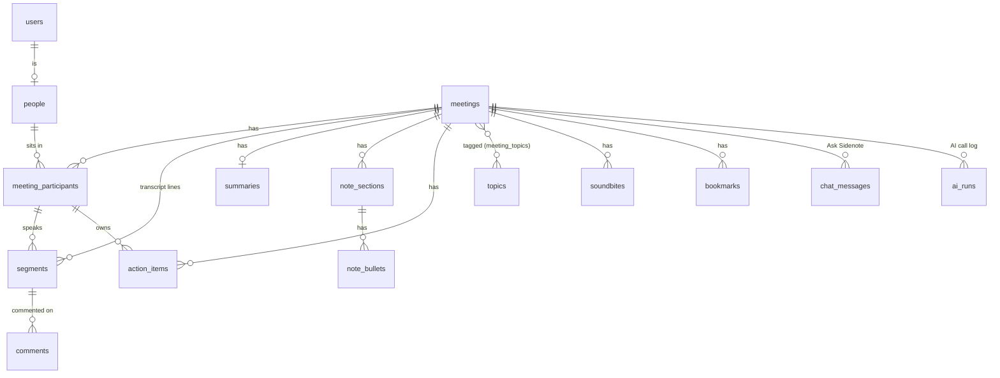

<div align="center">

# Sidenote

**Meeting notes you can search, question and play back.**
Browse your meetings, read AI notes and action items, click any line of the transcript to hear it, and ask what was said.

<a href="docs/media/sidenote-demo.mp4"></a>

**[▶ Watch the 40 second demo](docs/media/sidenote-demo.mp4)**

[**Live demo**](https://sidenote-kappa.vercel.app) · [Features](#what-it-does) · [Run it](#run-it) · [How it works](#how-it-works) · [Explain it](docs/EXPLAINED.md)



</div>

## What it does

| | |
|---|---|
| **Library** | Meetings grouped by day, with search, filters (people, date, length, tags) and channels |
| **Meeting page** | Real audio and a transcript that follow each other: click a line to jump, or play and watch the highlight move. Find-in-transcript with highlighted matches |
| **AI notes** | Summary, sectioned notes with clickable moments, action items grouped by person, sentiment, talk time. Edit, copy or regenerate |
| **Tasks** | Add, edit, assign and tick off action items, per meeting or across all meetings |
| **Collaborate** | Comments on a line, soundbites (clips that stop by themselves), bookmarks, tags |
| **Ask Sidenote** | Chat about one meeting or all of them. Answers cite moments you can click. Pick any configured AI provider and model |
| **Search anywhere** | `Cmd+K` finds titles, people and every word ever said, and opens the meeting at that moment |
| **People** | Who talks how much, which meetings, what they still owe |
| **Export** | Transcript as PDF, MD, TXT, JSON, SRT, CSV. Notes as PDF, MD, JSON |
| **Everything else** | Upload or paste a transcript (`.txt` `.vtt` `.json`), light and dark theme, toasts, settings |
| **On your phone** | Under 800px the sidebar becomes a slide-in menu, the top bar shrinks, and every page fits a 390px screen |

It works with no API key. The built-in logic writes notes and answers questions; add a key and a real model takes over.

<table>
<tr>
<td></td>
<td></td>
</tr>
<tr>
<td></td>
<td></td>
</tr>
</table>

## Run it

```bash
make install        # backend virtualenv, frontend packages, test browser
make run            # API on http://localhost:8000   (docs at /docs)
make run-frontend   # app on http://localhost:3000   (in a second terminal)
```

Sample meetings are created on first start. Needs Python 3.11+ and Node 20.9+.

**Turn on a real AI model (optional).** Copy `backend/.env.example` to `backend/.env` and set a key:

| Provider | Setting | Notes |
|---|---|---|
| Anthropic | `ANTHROPIC_API_KEY` | Claude models |
| OpenAI | `OPENAI_API_KEY` | `OPENAI_BASE_URL` points it at any compatible server |
| Google | `GEMINI_API_KEY` | Gemini |
| DeepSeek | `DEEPSEEK_API_KEY` | OpenAI-compatible, model `deepseek-v4-flash` |
| Groq, OpenRouter | `GROQ_API_KEY`, `OPENROUTER_API_KEY` | OpenAI-compatible |
| Ollama | `OLLAMA_BASE_URL` | local models |
| Built-in | nothing | always available, the default |

A provider shows up in the model picker only when its key is set. If a call fails for any reason, the built-in logic answers instead and the call is logged under **Settings → AI Settings**. Every provider gets the same prompts, which treat the transcript as data and never as instructions (so a line like "ignore previous instructions" inside a meeting is quoted, not obeyed), forbid invented facts, and keep Ask on the topic of your meetings. Adding a provider is one small file in `backend/app/services/llm/` and one line in `registry.py`.

## How it works



- **Backend** (`backend/app`): `routers/` are thin HTTP handlers, `services/` hold the logic, `models.py` is the schema, `seed.py` the sample data.
- **Frontend** (`frontend`): `app/` pages, `components/` UI pieces, `lib/` the API client, types and hooks. Plain CSS variables, no UI library.
- **Search** is SQLite FTS5, kept in sync by database triggers, so no application code can forget to update it.
- **Playback** uses a real audio element when a meeting has a recording and a timer clock when it does not (uploaded transcripts). Everything else reads the same `time`.

### Database



16 tables plus a search index. Two choices worth knowing: **people are global** and join a meeting through `meeting_participants`, so "everything Maya said across meetings" is one query; and **statistics (talk time, words per minute, sentiment split) are computed from the transcript when asked**, never stored, so they cannot go stale. Deleting a meeting cascades to everything under it; people in no meeting are removed.

### API

Every route is under `/api`. Interactive docs at `/docs` when the server runs.

| Area | Routes |
|---|---|
| Meetings | `GET/POST /meetings` · `GET/PATCH/DELETE /meetings/{id}` · filters: `q, participant, host, topic, after, before, min_minutes, max_minutes, source, sort` |
| Transcript | `GET /meetings/{id}/transcript?q=` · `PATCH /segments/{id}` · `GET /search?q=` |
| Notes | `GET/PATCH /meetings/{id}/summary` · `POST …/summary/regenerate` · `PATCH /note-bullets/{id}` · `GET …/insights` |
| Tasks | `GET /action-items` · `GET/POST /meetings/{id}/action-items` · `PATCH/DELETE /action-items/{id}` |
| Tags | `GET /topics` · `PUT/DELETE /meetings/{id}/topics/{name}` |
| Collaborate | comments, soundbites and bookmarks: `GET/POST /meetings/{id}/…`, `DELETE /…/{id}` |
| Ask | `POST /meetings/{id}/ask` · `POST /ask` · `GET/DELETE /chat` (and per meeting) |
| AI | `GET /llm/models` · `GET /ai-runs` |
| Export | `GET /meetings/{id}/export?what=transcript\|summary&format=…` |
| People | `GET /people` · `GET /people/{id}` · `GET /me` |

## Tests

**977 tests** across four layers, one command each.

| Layer | Where | What | Run |
|---|---|---|---|
| Backend unit | `backend/tests/unit` | in-memory database | `make test-unit` |
| Backend integration | `backend/tests/integration` | the real API on a seeded database | `make test-integration` |
| Frontend unit | `frontend/tests/unit` | Vitest + Testing Library | `make test-frontend` |
| Browser end to end | `frontend/tests/e2e` | Playwright, real backend, real audio | `make test-e2e` |

Currently **378** backend, **503** frontend and **96** browser tests, all passing (`make test-all`).
Some tests check the tests: breaking the code on purpose and confirming a test fails.

## Choices and limits

- **No real speech-to-text.** Meetings come from transcripts you upload or paste. The six sample meetings are read aloud by synthetic voices (macOS `say`, see `backend/scripts/make_sample_audio.py`) placed exactly at the transcript times.
- **No login.** Everyone is the one default user. Sharing, teams, integrations, live capture and analytics are labelled "coming soon".
- **People are matched by name.** Uploaded transcripts carry no email, so two different people with the same name would be treated as one.
- **SQLite.** Simple and easy to explain. The free hosting tier has no persistent disk, so on the demo the sample data is re-created at every restart.
- **Skipped on purpose:** DOCX and audio download (extra dependencies), a notification service (the bell is derived from your meetings), migrations (tables are created at startup).

## Deploy

**Backend on Render.** New → Blueprint → pick this repo (it reads `render.yaml`). Then set `CORS_ORIGINS` to your Vercel address. Optional: AI provider keys, for example `DEEPSEEK_API_KEY` (Environment tab; the service restarts by itself).

**Frontend on Vercel.** Import the repo, set the root directory to `frontend`, add `NEXT_PUBLIC_API_URL` = your Render address (no trailing slash).

After the free tier has been idle, the first request can take up to a minute while the API wakes up. Meetings you add to the live demo are not kept across restarts; the six sample meetings always come back.

## Project layout

```
backend/   FastAPI · SQLAlchemy · SQLite     frontend/   Next.js (App Router) · TypeScript
  app/routers   HTTP                           app/        pages
  app/services  logic (parser, AI, export)     components/ UI pieces
  app/models.py schema                         lib/        API client, types, hooks
  media/        sample recordings              tests/      unit + e2e
  tests/        unit + integration           docs/         EXPLAINED.md, screenshots
```

Want the reasoning behind the design? **[docs/EXPLAINED.md](docs/EXPLAINED.md)** walks through it in plain words.
